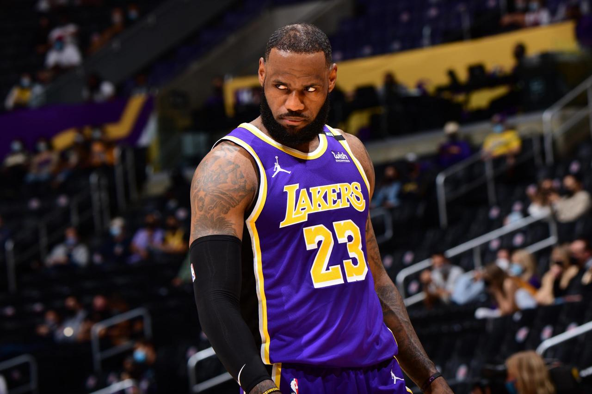
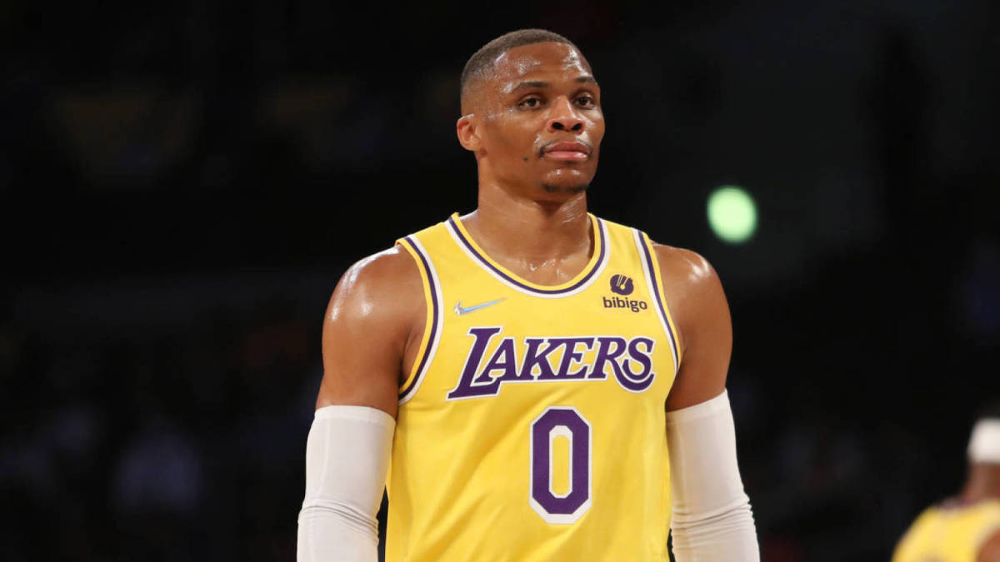

```{r setup, include=FALSE}
knitr::opts_chunk$set(echo = TRUE, message = FALSE,
                      warning = FALSE)
```


## Introduction: NBA

NBA, the National Basketball Association, is a professional basketball league in the United States. The league is composed of 32 teams, each of which competes for Conference Championship. The NBA is the most popular sport in the United States, with over 100 million people watching it every year. As of the time writing this article, the NBA is currently in its playoffs, and the final four teams are the **Golden State Warriors**, **Boston Celtics**, **Miami Heat**, and **Dallas Mavericks**.

Started in the year of 1946, there had been a lot of great players, here are some that the author like the most:

### Lebron James



As of 2022, 37-year-old Lakers player Lebron James has won:

- 4x NBA champion (2012, 2013, 2016, 2020)
- 4x NBA Finals MVP (2012, 2013, 2016, 2020)
- 4x NBA Most Valuable Player (2009, 2010, 2012, 2013)
- 18x NBA All-Star (2005-2022)
- 3x NBA All-Star Game MVP (2006, 2008, 2018)
- 13x All-NBA First Team (2006, 2008-2018, 2020)

### Russel Westbrook



As of 2022, 33-year-old Lakers point guard Russel Westbrook has won:

- NBA MVP (2017)
- 9x NBA All-Star (2011-2013, 2015-2020)
- 2x All-NBA First Team (2016, 2017)

## Motivation

On August 6, 2021, Westbrook was traded to the Los Angeles Lakers. As his first season with the Lakers progressed, Westbrook received criticism for his perceived poor quality of play. Westbrook shot 30 percent from the three-point line and turned the ball over 4.6 times per game through early January, and he received criticism for a particular game against the Minnesota Timberwolves where he turned the ball over nine times. Westbrook later responded to critics, saying that they were only looking at the stat sheet and not his overall play on the court. 

However, Westbrook also had some remarkable games during the season. On January 4, 2022, in a 122-114 win over the Sacramento Kings, Westbrook had his first game without turnovers since March 14, 2016. On January 29, in a 114-117 loss to the Charlotte Hornets, he scored 35 points, of which 30 in the second half (16 points in the fourth quarter from a 20-point deficit) were the most by any Laker since Kobe Bryant's last game on April 13, 2016.

**So the key question arises: Is Westbrook a good player in the 2021-22 season?**

To answer this question we shall introduce another statistics: **2k ratings**. Each year, 2k, a gaming company, releases a version of NBA video game that consist of all the players in the NBA. And base on the performance of each player, 2k assigns a **rating** to each player. The rating is an integer between 0 and 100. The higher a player's rating, the better a player is. For example, the rating of Lebron James in 2016-17 Season is 99, and the rating of Russell Westbrook in the same season is 93. A typical starter player will have a rating of ~80+, and a typical bench player will have a rating of ~70+. 

For this case study, we **assume the fact that each player's 2k rating is unbiased.** So to answer our case study question, we will use our model to predict the rating of Westbrook, base on his performance at the current season.

## Exploratory Data Analysis

### An Overview of Dataset

The dataset is downloaded as a csv file and is obtained from a [kaggle dataset by William Yu](https://www.kaggle.com/datasets/willyiamyu/nba-2k-ratings-with-real-nba-stats). 

While a full copy of the codebook is available in my zipped files, here are some of the key variables that are helpful to be aware of for this report:

- 

### Loading Data and Packages

We install some packages for data analysis.

```{r}
library(ggplot2)
library(tidyverse)
library(tidymodels)
library(corrplot)
library(ggthemes)
library(yardstick)
tidymodels_prefer()

setwd("~/Desktop/PSTAT 131/pstat131-project")
set.seed(1205)
```


```{r}
ratings <- read.csv(file = 'data/nba_rankings_2014-2020.csv')
summary(ratings)
```

As we can see from the summary statistics, there are a total of 2412 observations, and there are a total of 29 predictors. The variables I will be working with are all numbers, while some are strings. So far, there  is no missing data and the dataset is considered complete.

## Reference